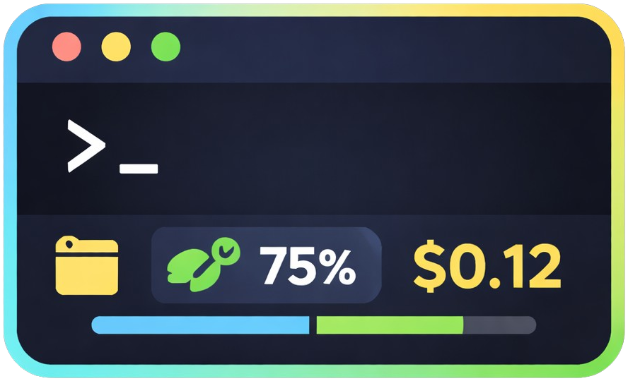
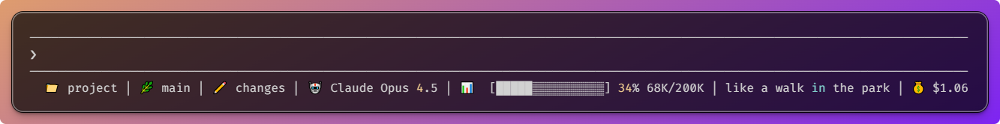

# Claude Code Statusline

<p align="center">
  
</p>

<p align="center">
  <strong>> Ridiculously simple. Surprisingly rich.</strong>
</p>

<p align="center">
  
  <a href="LICENSE">
    
  </a>
</p>

## 💡 What You Get

More context in Claude Code's statusline: directory, git status, file changes, model, context usage with progress bar, and cost — all visible at once.

<p align="center">
  
</p>

Install with one command. Works immediately. Configure when you need it.

## ✨ Quick Install

```bash
curl -fsSL https://raw.githubusercontent.com/glauberlima/claude-code-statusline/main/install.sh | bash
```

**Requirements**: bash, jq, git (the installer checks and shows install commands if needed)

## Features

- 📁 **Directory name**
- 🌿 **Git branch**
- ✏️ **File changes**
- 🤖 **Model name**
- 📊 **Context usage** with progress bar and funny messages
- 💰 **Cost tracking**

**Multi-language**: English, Brazilian Portuguese, Spanish

## ⚙️ Configuration

### Change Language or Toggle Components

**Option 1: Use the installer** (recommended for initial setup):

```bash
./install.sh
```

The installer lets you:
- Select language (🇺🇸 English | 🇧🇷 Português | 🇪🇸 Español)
- Enable/disable context messages
- Enable/disable cost display

**Option 2: Use the patch script** (for manual customization):

```bash
# Patch to Portuguese with all features
./patch-statusline.sh ~/.claude/statusline.sh messages/pt.json

# Disable messages
./patch-statusline.sh ~/.claude/statusline.sh --no-messages

# Spanish with cost tracking only
./patch-statusline.sh ~/.claude/statusline.sh messages/es.json --no-messages
```

The patch script creates a fully optimized, static version with zero runtime overhead. To change settings, re-run the patch.

### Add a Language

See [messages/README.md](messages/README.md) for translation guidelines.

## 🛠️ Development

### From Source

```bash
git clone https://github.com/glauberlima/claude-code-statusline.git
cd claude-code-statusline
./install.sh
```

### Testing

```bash
./tests/unit.sh && ./tests/integration.sh && ./tests/shellcheck.sh
```

### Contributing

1. Fork and create a feature branch
2. Make changes and run tests
3. Submit a pull request

See [CLAUDE.md](CLAUDE.md) for architecture details and development commands.

## Inspirations

- [Fatih Arslan](https://x.com/fatih/status/2003155214942241023)
- [Frank Dilo](https://x.com/frankdilo/status/2003383256205672753)

## License

[MIT License](LICENSE)
