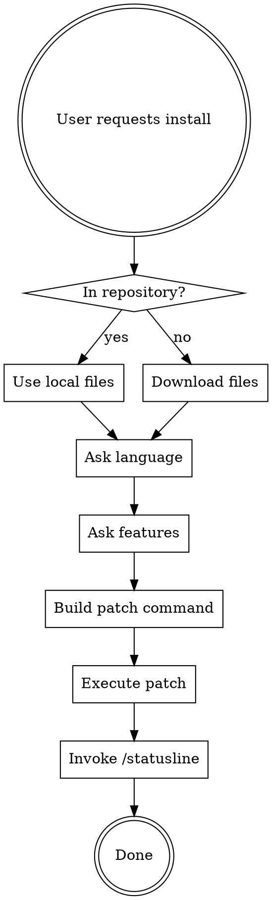

# Install Statusline

## Overview

Installs the claude-code-statusline project as the active Claude Code statusline with user-selected language and features.

**Core principle**: Always ask user preferences (language, messages, cost) before patching.

## When to Use

Use when:
- User asks to "install the statusline"
- User wants to set up claude-code-statusline
- User mentions using this statusline project

Don't use when:
- User is just exploring the codebase
- User asks about how statusline works (answer directly)

## Quick Reference

| Step | Action | Tool |
|------|--------|------|
| 1 | Detect if in repo or need download | Bash (pwd, ls) |
| 2 | Download files if needed | Bash (curl) |
| 3 | Ask language preference | AskUserQuestion |
| 4 | Ask feature preferences | AskUserQuestion |
| 5 | Patch statusline.sh | Bash (patch-statusline.sh) |
| 6 | Install via /statusline | Skill tool |

## Implementation

### Step 1: Detect Environment

Check if already in the claude-code-statusline repository:

```bash
# Check if critical files exist locally
if [[ -f "statusline.sh" && -f "patch-statusline.sh" && -d "messages" ]]; then
  # In repository - use local files
  WORKING_DIR="."
else
  # Need to download files
  WORKING_DIR=$(mktemp -d)
fi
```

### Step 2: Download Files (if needed)

If not in repository, download from GitHub:

```bash
cd "${WORKING_DIR}"
curl -sO https://raw.githubusercontent.com/glauberlima/claude-code-statusline/refs/heads/main/statusline.sh
curl -sO https://raw.githubusercontent.com/glauberlima/claude-code-statusline/refs/heads/main/patch-statusline.sh
chmod +x patch-statusline.sh
mkdir -p messages
curl -s https://raw.githubusercontent.com/glauberlima/claude-code-statusline/refs/heads/main/messages/en.json -o messages/en.json
curl -s https://raw.githubusercontent.com/glauberlima/claude-code-statusline/refs/heads/main/messages/pt.json -o messages/pt.json
curl -s https://raw.githubusercontent.com/glauberlima/claude-code-statusline/refs/heads/main/messages/es.json -o messages/es.json
```

**Why curl -s**: Silent mode reduces noise. Use -O for filename preservation.

### Step 3: Ask User Preferences

**REQUIRED**: Always ask before patching. Never assume defaults.

**REQUIRED**: Use the AskUserQuestion tool (NOT text questions). This provides structured UI for selection.

Use AskUserQuestion with 2 questions:

1. **Language selection**:
   - Header: "Language"
   - Options: English (en), Portuguese (pt), Spanish (es)
   - multiSelect: false

2. **Feature preferences**:
   - Header: "Features"
   - Options: "Funny messages" (SHOW_MESSAGES), "Cost tracking" (SHOW_COST)
   - multiSelect: true
   - Default: both enabled

Example:

```typescript
AskUserQuestion({
  questions: [
    {
      question: "Which language should the statusline use?",
      header: "Language",
      multiSelect: false,
      options: [
        { label: "English", description: "Default language with English messages" },
        { label: "Portuguese", description: "Brazilian Portuguese with cultural adaptations" },
        { label: "Spanish", description: "Spanish messages" }
      ]
    },
    {
      question: "Which features do you want enabled?",
      header: "Features",
      multiSelect: true,
      options: [
        { label: "Funny messages", description: "Context usage messages that change based on usage level" },
        { label: "Cost tracking", description: "Display total session cost in USD" }
      ]
    }
  ]
})
```

### Step 4: Build Patch Command

Based on user answers, construct patch-statusline.sh command:

```bash
# Map language choice to JSON file
case "${language_choice}" in
  "English") LANG_FILE="messages/en.json" ;;
  "Portuguese") LANG_FILE="messages/pt.json" ;;
  "Spanish") LANG_FILE="messages/es.json" ;;
esac

# Build command with flags
PATCH_CMD="./patch-statusline.sh statusline.sh ${LANG_FILE}"

# Add feature flags based on selections
[[ "${funny_messages_enabled}" != "true" ]] && PATCH_CMD+=" --no-messages"
[[ "${cost_tracking_enabled}" != "true" ]] && PATCH_CMD+=" --no-cost"
```

### Step 5: Execute Patch

Run the patch command:

```bash
bash -c "${PATCH_CMD}"
```

**Important**: patch-statusline.sh modifies statusline.sh in-place. It validates syntax with `bash -n` before completion.

### Step 6: Install via /statusline Command

**REQUIRED**: Call the Skill tool with skill="statusline" and the file path as args.

**Exact syntax** (replace /path/to with actual path):
```
Skill tool with:
  skill: "statusline"
  args: "/path/to/statusline.sh"
```

**WRONG approaches**:
- ❌ TaskCreate - Don't create tasks
- ❌ Manual cp - Don't copy to ~/.claude/ manually
- ❌ Text explanation - Don't explain what to do, DO it

**Why this works**: The Skill tool invokes Claude Code's built-in /statusline command which handles platform-specific installation, permissions, and integration correctly.

### Step 7: Cleanup (if downloaded)

If files were downloaded to temp directory:

```bash
# Note: Don't delete yet - /statusline needs to read the file first
# Cleanup happens automatically when temp dir is removed
```

## Understanding patch-statusline.sh

The patch script uses marker-based replacement:

1. **Reads markers**: Finds `@CONFIG_START` / `@CONFIG_END` and `@MESSAGES_START` / `@MESSAGES_END` in statusline.sh
2. **Extracts content**: Uses `sed -n` to extract content before/after markers
3. **Replaces blocks**: Inserts new config and messages between markers
4. **Validates syntax**: Runs `bash -n` to ensure patched script is valid
5. **Preserves permissions**: Uses `chmod --reference` to maintain executable bit

**Config block** (`@CONFIG_START` to `@CONFIG_END`):
```bash
readonly SHOW_MESSAGES=true  # or false
readonly SHOW_COST=true      # or false
```

**Messages block** (`@MESSAGES_START` to `@MESSAGES_END`):
```bash
readonly CONTEXT_MSG_VERY_LOW=(...)
readonly CONTEXT_MSG_LOW=(...)
readonly CONTEXT_MSG_MEDIUM=(...)
readonly CONTEXT_MSG_HIGH=(...)
readonly CONTEXT_MSG_CRITICAL=(...)
```

Messages are extracted from JSON using `jq` with `@sh` format for safe shell escaping.

## Complete Workflow



## Common Mistakes

| Mistake | Fix |
|---------|-----|
| Manual cp to ~/.claude/ | Use /statusline command (Skill tool) |
| Assuming default language | Always ask user preference |
| Skipping feature questions | Ask about messages and cost separately |
| Text-based questions | Use AskUserQuestion tool for structured selection |
| Using git clone | Download individual files with curl (faster, cleaner) |
| Forgetting chmod +x | patch-statusline.sh preserves permissions automatically |
| Not validating download | Check curl exit code and file existence |

## Red Flags

These indicate you're about to make a mistake:

- "I'll just install with default settings" → **STOP**: Ask user first using AskUserQuestion
- "Let me copy it to ~/.claude/" → **STOP**: Use Skill tool with "statusline" skill
- "I'll create a task for installation" → **STOP**: Use Skill tool directly
- "Let me ask the user via text" → **STOP**: Use AskUserQuestion tool
- "I'll clone the whole repo" → **STOP**: Download specific files only
- "The code isn't on GitHub yet" → **STOP**: Try downloading from main branch

## Real-World Impact

- **User choice matters**: Language and features significantly affect UX
- **Platform compatibility**: /statusline handles Windows/Linux/macOS differences
- **Clean installation**: Temp directory approach avoids cluttering filesystem
- **Validation**: patch-statusline.sh's `bash -n` check prevents broken installations
